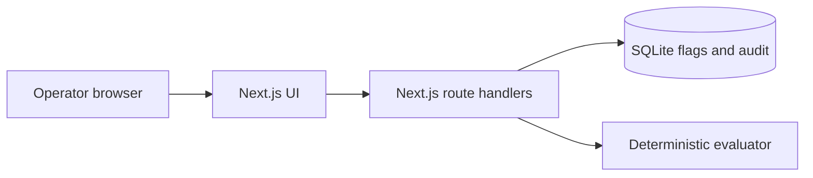

# ReleasePilot

ReleasePilot is a local feature flag control plane built with Next.js and TypeScript. It lets a team create flags, change rollout percentages, preview decisions for a subject, and inspect a versioned audit trail through the API.

**Status:** portfolio project. It is a functioning local application and has no production users. It is not a hosted feature flag service.

## Why this project

A Boolean flag is easy to implement. A useful release control plane also needs stable cohort assignment, an emergency off switch, protection against conflicting edits, and a record of who changed exposure. This project implements the underlying behavior without adding a message broker or microservices that the local use case does not need.



## Requirements and run

- Node.js 26 or newer (uses the built-in `node:sqlite` module)
- npm

```bash
cp .env.example .env.local
# Set ADMIN_KEY to a random secret of at least 24 characters
npm install
npm run dev
```

Open `http://localhost:3000`, enter the same admin key in the access field and load flags. The key stays in tab memory, not local storage. It is transmitted to the local API in `x-admin-key`. Use `npm test` and `npm run build` to verify the project. Data is stored in `data/releasepilot.db`, ignored by Git.

## API

All endpoints require `x-admin-key`. `GET /api/flags` lists flags. `POST /api/flags` creates a disabled flag with `{"key":"new_checkout","description":"Gradual rollout"}`. `PATCH /api/flags/new_checkout` changes state with `{"version":1,"enabled":true,"rollout":25}`. A stale version returns 409. `GET /api/flags/new_checkout` returns the flag plus its last 50 audit entries. `POST /api/evaluate` with `{"key":"new_checkout","subject":"account-42"}` returns the decision, bucket and flag version.

## Design decisions

- **Stable rollout:** SHA-256 of flag salt, key and subject maps a subject to one of 10,000 buckets. Increasing rollout generally preserves previously enabled subjects, while different flags have independent cohorts.
- **Emergency stop:** `enabled=false` always returns false regardless of percentage.
- **Optimistic concurrency:** updates require the current `version`. The update and audit entry are in one database transaction.
- **Server-owned secrets:** the admin key is kept in an environment variable and compared in constant time. The browser holds only the value typed for the current tab. Do not use the example key in a deployment.
- **SQLite:** local operation needs no external infrastructure. A multi-instance deployment would replace SQLite with PostgreSQL and add organization identity, per-environment flags, fine-grained roles, and a dedicated evaluation token.

The evaluator never records subject IDs. There is no tracking or analytics pipeline. The current UI is intended for local review; deployment behind the public internet would require TLS, managed authentication, rate limiting, backups, and an evaluation endpoint with separate credentials.

## Interview questions this project can support

- How does deterministic bucketing avoid a database lookup for every subject?
- What happens when the rollout goes from 25% to 40% or the salt changes?
- Why does a stale version return 409? What if two operators update simultaneously?
- How would you serve evaluations at high volume while keeping emergency disable responsive?
- What would change for multiple tenants, environments, and SDK clients?

## Roadmap

1. Add named environments and organization roles.
2. Add a cache or published snapshot for high-volume evaluations.
3. Add a signed, low-privilege evaluation token and rate limiting.
4. Add integration tests for route handlers and audit behavior.
